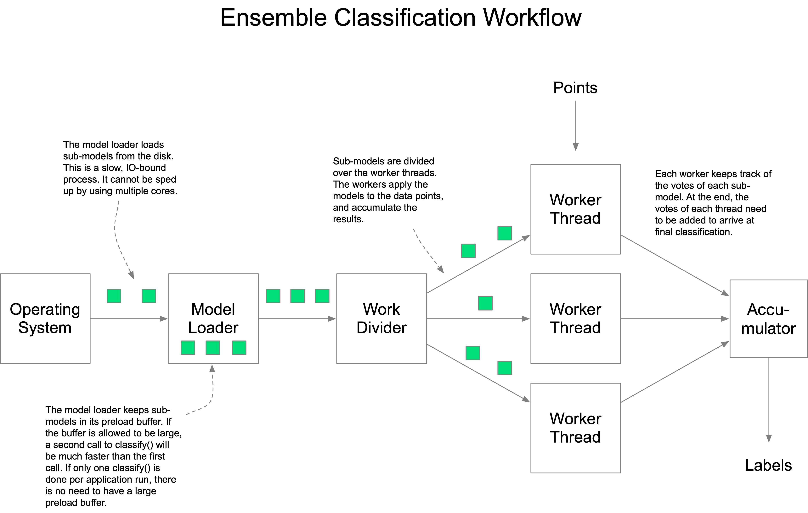
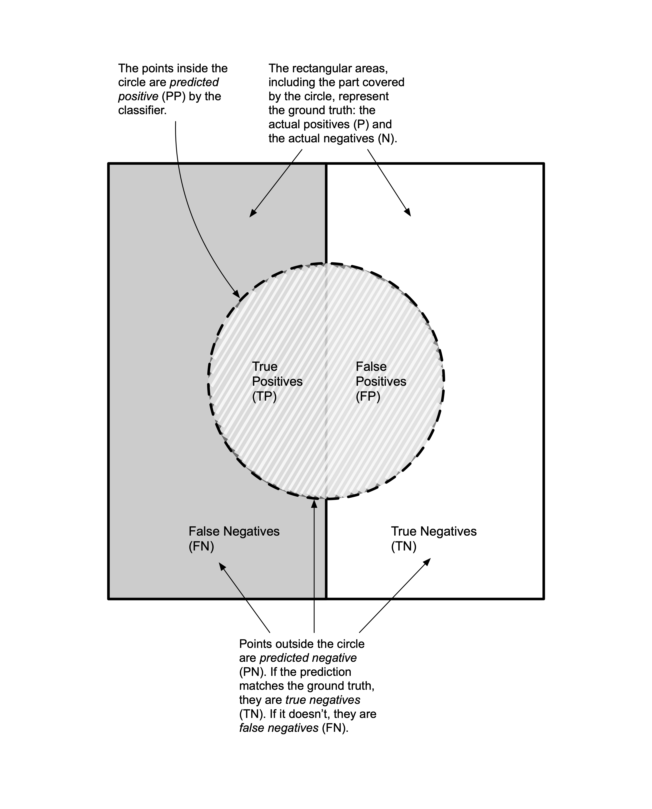

# Balsa: A Fast C++ Random Forest Classifier

<a name="introduction"></a>
## Introduction

Balsa is a fast and memory-efficient C++ implementation of the RandomForest classification algorithm. Balsa is optimized for low memory usage and high speed during both training and classification. It is particularly useful for training on larger datasets, and for near-real time classification.

<a name="tableofcontents"></a>
## Table of Contents

1. [Introduction](#introduction)
1. [Table of Contents](#tableofcontents)
1. [Package Contents](#packagecontents)
1. [Theory and Terminology](#theoryandterminology)
	1. [Classification](#theoryclassification)
	1. [Training](#theorytraining)
	1. [Data Sets](#theorydatasets)
	1. [Probabilities and Odds](#theoryprobabilitiesandodds)
	1. [Decision Trees](#decisiontrees)
	1. [Training Decision Trees](#trainingtrees)
	1. [Random Forests](#randomforests)
1. [Installation](#usingbalsa)
	1. [Prerequisites](#prerequisites)
	1. [Building and Installing Balsa](#buildandinstall)
1. [Using Balsa from the Command Line](#balsacommandline)
	1. [Creating Test Data](#balsagenerate)
	1. [Training on the Command Line](#balsatrain)
	1. [Classification on the Command Line](#balsaclassify)
	1. [Printing Balsa Files](#balsaprint)
1. [Using Balsa From C++](#usingbalsacpp)
	1. [Including Balsa in a C++ Project](#cppincludingbalsa)
	1. [Training in C++](#cpptraining)
	1. [Classification in C++](#cppclassification)
	1. [Using Custom Containers](#cppcustomcontainers)
	1. [Using Single-Precision Features](#cppsingleprecision)
1. [Optimizing System Performance](#optimizingsystemperformance)
	1. [Quantifying System Performance](#quantifyingsystemperformance)
	1. [Optimizing Trainer Resource Usage](#optimizingtrainingperformance)
	1. [Optimizing Classifier Resource Usage](#optimizingclassifieresourceusage)
	1. [Internals of the Balsa Classifier](#classifierinternals)
	1. [Rules of Thumb](#rulesofthumb)
1. [Optimizing Model Performance](#optimizingmodelperformance)
	1. [General Approach](#generalapproach)
	1. [Fundamental Properties](#fundamentalproperties)
	1. [The Confusion Matrix](#confusionmatrix)
	1. [Performance Metrics](#performancemetrics)
		1. [True Positive Rate and True Negative Rate](#tprtnr)
		1. [False Positive Rate and False Negative Rate](#fprfnr)
		1. [True Positive Odds and False Positive Odds](#tpofpo)
		1. [Positive Predictive Value and Negative Predictive Value](#ppvnpv)
		1. [Accuracy](#accuracy)
		1. [F-beta Score](#fbetascore)
		1. [Diagnostic Odds Ratio](#diagnosticoddsratio)
		1. [P4 Metric](#p4metric)
1. [Contact and Credits](#contactandcredits)
1. [License](#license)

<a name="packagecontents"></a>
## Package Contents [(top)](#tableofcontents)

The Balsa package provides a trainer and classifier that can be used from the command-line or from within a third-party C++ application. In addition, it provides a number of utilities for manipulating data files, and for evaulating classifier performance.

The Balsa package provides the following command-line tools:

* **balsa\_train** trains Balsa models on known/labeled data sets.
* **balsa\_classify** classifies unknown datasets using a Balsa-trained model.
* **balsa\_print** prints the contents of Balsa point files, label files, and models in human-readable form.
* **balsa\_generate** generates random data sets for testing and experimentation.

These tools are built and installed as part of a standard [Balsa installation process](#installation).

<a name="theoryandterminology"></a>
## Theory and Terminology [(top)](#tableofcontents)

This section provides the minimal theoretical background that is required to use Balsa. It introduces the jargon (with important terms in *emphasis*) that is used and assumed to be known throughout the Balsa documentation.

<a name="theoryclassification"></a>
### Classification [(top)](#tableofcontents)

*Classification* is the process of assigning one of a fixed number of *labels* (or *classes*) to a set of *data points*. Each data point consists of a fixed number of numeric values, known as *features*. 

Consider the following example: a conveyor belt transports apples and oranges through a sorting machine. To separate the apples from the oranges, the machine photographs each piece of fruit, and counts the average red-, green-, and blue- values of each pixel in the image. It also records the weight of each item. This leads to the following set of data points:

| Weight | Red | Green | Blue |
|--------|-----|-------|------|
| 133    | 255 | 204   | 102  |
| 88     | 152 | 255   | 51   |
| 163    | 250 | 152   | 99   |
| 99     | 248 | 199   | 89   |

Each row in the table is a *data point*, each column is a *feature*. The problem of applying the correct *label* ('apple' or 'orange') to each data point is called a *classification problem*. Equivalently, we could say that the machine tries to determine to which *class* each piece of fruit belongs. 

This is an example of a *binary classification problem*, because there are only two classes to distinguish. Classification problems with more than two classes are called *multi-valued classification problems*. Certain standard concepts take their name from the binary version of the classification problem, even if generalizations for the multi-valued case exist. Additionally, some performance metrics and machine learning algorithms are only applicable to the binary case.

<a name="theorytraining"></a>
### Training [(top)](#tableofcontents)

The classification problem can be solved by fitting a mathematical model (a *predictive model*) to a set of data points for which the labels are already known. The model can then be used to predict the labels of data points for which the labels are not known. This model fitting process is called *training*. 

To train a good model, the labels in the known dataset need to be as accurate as possible. For the fruit sorting example, it would be possible to obtain a highly accurate training set by letting a human observer classify the fruit by hand. In a very reliably labeled data set like this, the labels are called the *ground truth* of the data set. This term is often used more loosely to refer to the labels of the known data set in applications where the observations may not be 100% reliable. A data set with ground truth is sometimes called a *gold standard*.

Labels are usually represented as integers in machine learning, because the actual semantic interpretation is not important or meaningful to the software. Using 0 to identify oranges and 1 to identify apples, the ground truth for the example data points might look like this:

| Apple? |
|--------|
| 0      |
| 1      |
| 0      |
| 1      |
| ...    |


<a name="theorydatasets"></a>
### Data Sets [(top)](#tableofcontents)

A data set is usually a *sample* of points from a larger, potentially infinite, *population*. There may be differences in the number of times we encounter a point of a certain class in a population. The *class probability* describes how often a randomly drawn point from the population will be in a certain class. Probabilites are numbers between 0 and 1. The probabilities of all classes add up to 1. A function that associates each class with its class probability is called the *distribution* of the population. The class probability is sometimes called the *prevalence* of the class, especially in medical applications (e.g. the prevalence of a disease in a population.)

Similarly, a sample data set that is drawn from a population will have a *relative frequency* for each class. The relative frequency is the number of occurrences of that class in the data set, divided by the total number of points in the data set. Like probabilities, the relative frequencies of all classes must sum up to 1. As the number of data points in a sample gets larger, the relative frequencies will get closer to the probabilities of the population from which the sample was taken, due to the *Law of Large Numbers*.  It is unlikely that they will match the class probabilities of the population exactly.

If the class probabilities in a population are nearly the same, the population is said to be *balanced*. If there are major differences, the population is said to be *unbalanced*. The same terminology is used for sample data sets and relative frequencies.

**N.B. for training purposes, it is usually necessary to create a balanced training set, even if the sample is taken from an unbalanced population!**

In the example of the fruit machine, let's assume that the endless stream of fruit that comes onto the conveyor belt consists of 78% apples and 22% oranges. The class probabilities in the population are then 0.78 and 0.22. A sample containing 1000 pieces of fruit drawn from the belt may contain 763 apples and 237 oranges. The relative class frequencies in that sample are 0.763 and 0.237. Both the sample and the population are unbalanced. In order to create a balanced training set, we can randomly pick exactly 237 apples from the unbalanced set. Combined with the 237 oranges, we then have a balanced training set of 474 points.

<a name="theoryprobabilitiesandodds"></a>
### Probabilities and Odds [(top)](#tableofcontents)

In Anglo-centric parts of the world, probabilities are often expressed as *odds*, in particular when dealing with binary problems. The use of odds is much less common in other parts of the world, to the extent that some languages may not even have a common word for them. Since odds are used in the definition of certain quality metrics, it is important to understand the difference between odds and probabilities, and to be able to convert back and forth between them.

A probability tells us how likely it is that a random event has a certain outcome A. Odds tell us how much *more* likely it is that the event has outcome A, versus it not having outcome A. Odds are the ratio between two probabilities: the probability of the event happening, versus it not happening. 

A probability is a value between 0 and 1 (including the boundaries). Odds are often given as a ratio of to integers ("the odds are 3 to 10"), but they can take any non-negative real value, including Pi and the square root of 2.

As an example, consider a football match between Team A and Team B. A bookmaker may say that the odds of Team A winning are 10 to 1 (also written '10:1'). This means that the probability that Team A wins is 10 times the probability that Team B wins. We can then calculate that the probability of Team A winning must be 10/11, versus 1/11 for Team B. 

By analogy, we will define *class odds* as the odds that a data point belongs to a certain class, versus the point not belonging to that class. If the class probability of a point is given as p and the class odds are q, probabilities are converted to odds as follows:

* If the class probability p is given as a real number, the class odds are given by q = 1 / ((1/p) - 1).
* In the special case where p is expressed as an integer fraction p = a/b, the class odds are q = a / (b - a).

If the odds q are given instead, conversion to probabilities is as follows:

* If the odds are given as a real number q, the probability p is given by p =  1 / ((1/q) + 1). 
* In the special case where odds are given as an integer ratio a:b, then q = a/b gives p = a / (a + b).

<a name="decisiontrees"></a>
### Decision Trees [(top)](#tableofcontents)

A *Decision Tree* is a very simple example of a classifier. The tree consists of *nodes*. Each node can have either zero or two child-nodes. Nodes without children are called *leaf nodes*, nodes with two children are called *internal nodes*.

The internal nodes of a decision tree contain predicates of the form `p[f] < L`, where p[f] is the value of feature f in the data point p, and L is some scalar. Only the values of f (the *Split Feature ID*) and L (the *Split Value*) are stored in the internal tree node, because the form of the predicate is always the same. The tuple (f,L) is called a *split*.

The leaf nodes of the tree contain class labels. A data point p is classified by starting at the root node. If the node predicate evaulates to true, evaluation is continued at the right child node, otherwise it continues at the left child node. When a leaf node is reached, its label is applied to the data point.

<a name="trainingtrees"></a>
### Training Decision Trees [(top)](#tableofcontents)

The training process of a decision tree consists of building a tree that will, to some desired extent, correctly classify a given training data set. If all data points in the data set are unique, it is straightforward to find a decision tree that classifies all data in that set 100% correctly. To do so, we can pick any feature f and any split value L that splits the data points in two nonempty parts. We continue to split each sub-group of points further until there are only points in each sub-group that all have the same label. 

Depending on the exact choices we make, we can construct many different but equivalent decision trees that will perfectly fit the training data. Note, however, that two equivalent trees may give different results for out-of-bag data.

A good decision tree trainer will try to find a very small decision tree for a given data set, i.e. a tree with the smallest number of nodes. Small trees are easier to store, and less costly to evaluate during classification. The most common strategy for finding small trees is to find splits that cause the maximum amount of *information gain* (*Shannon Entropy*). Searching for optimal splits is a computationally intensive task, because the information gain has to be calculated at every potential split position. For this reason, the *Gini Gain* is often used as a slightly less computationally expensive approximation of to Shannon Entropy.

It is possible (and often useful) to control or limit the growth of a decision tree. This can be done by limiting the maximum depth of the tree to a certain node count, or by terminating the node-splitting process once a node is pure enough, as opposed to 100% pure. Terminating the growth early will result in a less good fit on the training data, but in some cases it can perform better on out-of-bag data, as it avoids *overfitting* on the training data.

<a name="randomforests"></a>
### Random Forests [(top)](#tableofcontents)

Using a random number generator, we can randomly restrict the features that a decision tree trainer is allowed to scan while searching for an optimal split. This strategy creates a decision tree with a randomized topology: a *Random Decision Tree*. Random decision trees that are trained on the same data will have slightly different strengths and weaknesses compared to one another, when used to classify out-of-bag data.

An *Ensemble Classifier* is a strong classifier that is composed of a larger group of weaker classifiers. An ensemble classifier accumulates the opinions (votes) of the individual classifiers to arrive at a final label for a point p. It can be shown that an ensemble classifier gives better classifications than its component classifiers, under the assumption that the individual classifiers form a diverse enough group.

A *Random Forest Classifier* is an ensemble classifier that is composed of random decision trees. Usually, the random decision trees are not fully grown. Random Decision Trees are weak classifiers. A forest with enough of them is a stronger classifier.

<a name="installation"></a>
## Installation [(top)](#tableofcontents)

This section describes how to install and use the Balsa command-line tools and the Balsa C++ library. We recommend working through the examples using the command-line tools first, before using Balsa in a C++ project.

<a name="prerequisites"></a>
### Prerequisites [(top)](#tableofcontents)

The core Balsa command-line tools and C++ library have the following system prerequisites:

* A C++17 compliant **C++ compiler**.
* The **CMake** build system.

N.B. exact version requirements for both the C++ standard and the CMake build system are checked by the CMake build files.

The following optional prerequisites apply:

* To use the optional *classifiert* utility, **Python 3** is required.
* For command-line builds on Windows (recommended), Microsoft's **NMake** utility is recommended.
* A **Markdown** viewer or Markdown-to-HTML conversion tool is recommended for reading this manual.
* Balsa's trainer can optionally write decision trees to the Graphviz 'dot' format. These files can be converted to PDFs for visual inspection using the **Graphviz** command line tools.

<a name="buildandinstall"></a>
### Building and Installing Balsa [(top)](#tableofcontents)

On UNIX systems (Mac, Linux) run the following commands from the top-level source directory to build Balsa:

```
mkdir build
cd build
cmake ..
make
```

The equivalent procedure for Windows (using NMake) is to open a Visual Studio Command Prompt in the top-level source directory, and to execute the following commands:

```
mkdir build
cd build
cmake -G "NMake Makefiles" ..
nmake
```

After building the software, it can be installed using `make install` (UNIX) or `nmake install` (Windows). The command-line tools, C++ library, and C++ header files are installed in system-wide standard locations. [The CMake manual](https://cmake.org/cmake/help/latest/guide/tutorial/index.html) contains additional information for installing into custom directories.

<a name="balsacommandline"></a>
## Using Balsa from the Command Line [(top)](#tableofcontents)

<a name="balsagenerate"></a>
### Creating Test Data [(top)](#tableofcontents)

The **balsa_generate** tool generates structured random test data sets for experimentation and education. Given a data set specification file as input, it generates one file containing data points, and one file containing labels that can be used for training.

A data set description for balsa_generate for our earlier apples-and-oranges example might look like this:

	multisource(4)
	{
		source(78)
		{
	                feature = gaussian(122, 11  );
	                feature = gaussian(40 , 9   );
	                feature = gaussian(13 , 12  );
	                feature = uniform( 100, 150 );
		}
		source(22)
		{
	                feature = gaussian(100, 10  );
	                feature = gaussian(100, 10  );
	                feature = gaussian( 20, 10  );
	                feature = uniform( 110, 155 );
		}
	}

The first line of the file specifies that the data set is to be drawn from a 'multisource' population (this is currently the only supported type). There will be 4 features per data point, indicated by the number 4 between braces. 

The body of the multisource population describes two data generation sources. Each source corresponds to a ground-truth label in the data set. By defining two sources, the generated data set will be for a binary classification problem.

Each source definition contains an integer weight that defines the relative frequency of that class in the sample data set. By convention, these numbers add up to 100% (78% 'apples', 22% 'oranges', as per the earlier example), but this is not necessary. The data generator will normalize the numbers.

Each source definition body contains one generator statement for each of the four features. Feature values can be drawn from either a Gaussian distribution (normal distribution) or from a uniform distribition. For gaussians, the parameters are mean and standard deviation, for uniform distributions, the parameters are the lower- and upper bounds.

To generate data, save the example to a text file called "fruit.conf" and run balsa_generate:

	balsa_generate fruit.conf fruit-points.balsa fruit-labels.balsa

The generator will create two output files: "fruit-points.balsa", which contains the point data drawn from the two sources, and "fruit-labels.balsa" containing the labels/ground truth. By default, the generator will draw 1000 points using a randomly chosen random seed. Running balsa_generate without giving it file names will print usage information. The usage information describes how the default point count and random seed can be changed.

<a name="balsatrain"></a>
### Training on the Command Line [(top)](#tableofcontents)

The balsa_train tool trains a Random Forest model on a set of labeled training data. For the fruit example, the invocation may look like this:

	balsa_train fruit-points.balsa fruit-labels.balsa fruit-model.balsa

This command creates "fruit-model.balsa" from "fruit-points.balsa" and "fruit-labels.balsa". Various parameters of the training process can be controlled to make trade-offs between the disk usage of the generated model files, the processor/multi-core utilization, wall-clock time, predictive performance, etc. 

Running `balsa_train` without any arguments displays the full range of options. By default, balsa\_train creates a forest of 150 trees of unlimited depth, using one thread/core for training. This is fine for initial experimentation on small test sets, but it is almost never the best option for your application. In order to get the best results, both in terms of runtime/speed and in terms of classification power, you will need to tune the parameters of balsa_train. The chapters [Optimizing Resource Usage](#optimizingresourceusage) and [Optimizing Model Performance] (#optimizingmodelperformance) cover the tuning process in detail.

<a name="balsaclassify"></a>
### Classification on the Command Line [(top)](#tableofcontents)

A model can be used to classify a (known or unknown) data set. For experimentation purposes, you can generate a second test set called "fresh-fruit-data" using balsa_generate with a different seed. To classify the data set using a model, run: 

	balsa_classify fruit-model.balsa fresh-fruit-data.balsa fresh-fruit-labels-classified.balsa

The first two parameters are the trained model file and the unknown new data file. The last parameter is the name that will be used to store the classifier output. This file can be compared to actual labels (e.g. from balsa_generate) for evaluation of the model.

The resource usage of the command-line classifier can be tuned to achieve to achieve shorter wall-clock times at the expense of additional memory usage and CPU load. We note, however, that the command-line classifier is already extremely fast and memory-efficient in single-threaded mode. The chapters on [Optimizing Resource Usage](#optimizingresourceusage) and [Optimizing Model Performance] (#optimizingmodelperformance) cover the tuning process in detail.

<a name="balsaprint"></a>
### Printing Balsa Files [(top)](#tableofcontents)

Balsa stores point data, labels, and random forest models in its own binary file format. The balsa_print tool prints the file contents in human-readable form. Point data files can be printed as follows:

	balsa_print fruit-points.balsa

Point files consist of tables of floating point data (single or double precision). Point data files are printed as rows with row numbers. Each row represents one point, each column the value of one feature:

	0   : 123.254  49.3648  2.60469  102.836 
	1   : 123.303  43.3323  -5.20379 123.883 
	2   : 117.016  48.7571  30.2484  147.858 
	3   : 95.3145  35.7631  -2.33779 143.504 
	4   : 137.605  48.5247  41.5867  137.931 
	5   : 123.062  50.5145  26.0258  123.68  
	6   : 129.762  32.5552  6.70585  119.324 
	7   : 112.713  36.4109  8.01106  122.497 
	8   : 124.271  30.4602  30.1559  116.252 
	9   : 122.74   35.8881  20.3795  131.714 
	10  : 137.61   17.3431  26.7889  133.738
	
Label files are printed in a similar manner:

	balsa fruit-labels.balsa

Label files are printed with a row number. Each row is one point. There is only one column, which contains the label. Labels are integers between 0 and 255:

	0   : 1   
	1   : 0   
	2   : 1   
	3   : 1   
	4   : 0   
	5   : 0   
	6   : 1   
	7   : 1   
	8   : 0   
	9   : 0   
	10  : 0  

Random forest model files consist of multiple individual trees. Each tree is separately marked. A fragment of an example output file might look like this:

	FOREST
	TREE 7 features.
	N:   L:   R:   F:   V:              L:
	0    1    2    5    0.73222         1   
	1    3    4    0    0.077147        1   
	2    5    6    1    60.0028         0   
	3    7    8    5    0.647682        1   
	4    9    10   0    0.110652        1   
	5    11   12   0    0.379905        0   

The FOREST marker is printed once. The TREE marker and header is printed before each tree. It includes the feature count of the tree. Trees are printed in tabular form. The columns are **N**ode identifier, **L**eft node, **R**ight node, the **F**eature on which the node is split, the feature **V**alue on which the node is split, and the **L**abel of the most prevalent class in the node. N.B. the left- and right- node IDs are nonzero  for internal tree nodes, and zero for leaf nodes. The node with ID 0 is always the root node of the tree. 

<a name="usingbalsacpp"></a>
## Using Balsa from C++ [(top)](#tableofcontents)

The core of Balsa is a C++ library that can be used directly from within a third-pary C++ application. Both training and classification can be done in this manner. A mixed approach (e.g. training using the command-line tool balsa_train, classification from a custom C++ application) is fully supported.

<a name="cppincludingbalsa"></a>
### Including Balsa in a C++ Project [(top)](#tableofcontents)

To include Balsa in a C++ project, you will need to include the installed Balsa header in your C++ source file(s):

	#include <balsa.h>

To compile and link, specify the correct minimal C++ standard, and link against the Balsa library. On UNIX systems, a typical invocation might look like this:

	c++ -std=c++17 fruit-classifier.cpp -lbalsa -o fruit-classifier

<a name="cpptraining"></a>
### Training in C++ [(top)](#tableofcontents)

The following complete example shows how a Balsa data model can be loaded and trained in C++:

	#include <iostream>
	#include <balsa.h>
	
	int main( int, char ** )
	{
		// Load data and labels.
		auto dataSet = Table<double>::readFileAs( "fruit-data.balsa" );
		auto labels  = Table<Label>::readFileAs( "fruit-labels.balsa" );
		
		// Train a random forest on the data, write the model to a file.
		RandomForestTrainer trainer( "fruit-model.balsa" );
		trainer.train( dataSet, labels );

		return 0;
	}

Remarks:	

* This example is included for documentation completeness. For most applications, the recommended approach is to train using the stand-alone balsa_train tool. The results will be identical either way.
* In this example, training points and labels are loaded into Balsa tables (instances of the Table<T> template). These tables are strongly typed. The 'readFileAs()' function reads the data from a Balsa file as-is if the type of the Table matches the type of the data in the file. Conversion is performed if there is a mismatch. This conversion comes at a minor performance penalty that may be significant for large datasets. Conversion from a higher precision file to a lower precision Table results in information loss.
* The constructor of the RandomForestTrainer takes a number of parameters (defaulted in this example). These parameters control the maximum depth, number of trees, number of thread to use, etc. Consult the API documentation for the details and options.

<a name="cppclassification"></a>
### Classification in C++ [(top)](#tableofcontents)

The following complete example shows how a data set can be classified from within a C++ application:

	#include <iostream>
	#include <balsa.h>
	
	int main( int, char ** )
	{
		// Read (and possibly convert) the data.
		auto dataSet = Table<double>::readFileAs( "fruit-data.balsa" );
		
		// Classify the data.  		
		Table<Label> labels( dataSet.getRowCount(), 1 );
		RandomForestClassifier classifier( "fruit-model.balsa", dataSet.getColumnCount() );
		classifier.classify( dataSet.begin(), dataSet.end(), labels.begin() );
	
		// Write the result to a binary Balsa output file.
		std::ofstream outFile( "fruit-classifier-labels.balsa", std::ios::binary );
       labels.serialize( outFile );
			
		// Print the results as text (or write to a text file).
		std::cout << labels << std::endl;
		
		return 0;
	}

Remarks: 

* This example uses Balsa Tables for storing the data and labels. It is possible (and recommended) to do classification in-place on points in your own data containers. This is covered in the next example.
* The RandomForestClassifier has additional parameters that are not shown in this example, due to defaults. These parameters are documented in the API documentation.
* Take note of the fact that binary serialization is done using the serialize() method, whereas the stream operator is used for output as text.

<a name="cppcustomcontainers"></a>
### Using Custom Containers [(top)](#tableofcontents)

The classification example in the previous section uses Balsa Tables for storing input and output. In high performance applications, it is often much more efficient to keep your data points in the container that already holds them. This prevents expensive copying to- and from Balsa Tables.

In order to maintain efficiency, the RandomForestClassifier class is a template that can be configured to classify your data in-place. Specifically, the iterators that point to the input data, and the iterators that point to the output location can be redefined. There are some restrictions to adhere to:

1. The input iterators must adhere to the `std::random_access_iterator` concept.
2. The input iterators must point to a floating-point type (double or float).
3. The input iterator must iterate over the points and features in row-major order.
4. The output iterator for labels must point to an numeric type.

In practice, these restrictions mean that the point data in your application must be layed out consecutively in memory, in row-major order.

The following program demonstrates how the classifier can be instantiated for different types of input- and output containers.

	// Create alternative data- and label-containers.
	typedef std::vector<float>  Points;
	typedef std::valarray<int>  Labels;
	Points points( 100 );
	Labels labels( 100 );

	// Create a classifier for these container types.
	RandomForestClassifier<Points::const_iterator,Labels::iterator> classifier( "fruit-model.dat", 4 );

	// Classify the points.
	classifier.classify( points.begin(), points.end(), labels.begin() );

The default template parameters for RandomForestClassifier are `double *` for data point iterators and `Label *` for label iterators.

<a name="cppsingleprecision"></a>
### Using Single-Precision Features [(top)](#tableofcontents)

By default, Balsa uses double-precision floating point numbers for feature values during training and classification. For many applications this precision is overkill. It can be beneficial to use single-precision floats, which would effectively halve the memory usage of the trainer and classifier. 

Changing the precision of the trainer is done using a template parameter of the trainer:

	// Create a single-precision trainer.
	RandomForestTrainer<float> trainer1(...):

	// Create a double-precision trainer (the default).
	RandomForestTrainer<double> trainer2(...);

The feature type of the classifier is implicitly derived from the pointed-to type of the output container:

	// Create a single-precision trainer.
	RandomForestClassifier< Table<float>::ConstIterator > trainer3( ... );
	
Remarks: 

* Changing from double to single precision has significant impact on the memory usage of the trainer. The memory usage of the classifier is extremely low even at double precision, so the impact will be far less noticeable there.
* To prevent unnecessary time loss during model loading, train and classify with the same precision as the data that will be used during classification.

<a name="optimizingsystemperformance"></a>
## Optimizing System Performance [(top)](#tableofcontents)

Balsa is designed to be a very fast, resource-efficient implementation of the Random Forest algorithm. In order to get the best possible performance out of it in terms of peak memory usage, wall-clock time, and CPU utilization, it is necessary to have some insight into the inner workings of the library. This section provides insights, tools, and guidelines for optimizing system performance. 

Balsa's efficiency is most apparent when dealing with larger training data sets. For smaller data sets (up to 1 million points, 10 features) other Random Forest implementations may be slightly faster, and/or have a smaller memory footprint. As training sets get larger, Balsa performance will generally scale very well.

N.B., this section is about optimizing speed, memory usage, etc. The topic of optimizing the quality and strength of the classifier is discussed [here](optimizingmodelperformance).


<a name="quantifyingsystemperformance"></a>
### Quantifying System Performance [(top)](#tableofcontents)

All computer programs use scarce system resources. These resources include storage space, system memory (RAM), and processor time (CPU time). When data sets are large, one or more of these resources can become a practical bottleneck. If this happens, a machine-learning solution can become unusably slow on a particular system. In order to make trade-offs, it is useful to quantify the system performance of a trainer or classifier in terms of its impact on system resources.

The following metrics are useful to evaluate the resource usage of a program:

* **Wall-clock Time** is the total amount of time it takes to complete the a run of the program.
* **Total CPU Time** is the total amount of time the program was active on a CPU, summed over all available CPUs.
* **Peak Memory Usage** is the largest amount of internal memory (RAM) the program used at any time during its run.
* **Disk Space Usage** is the total amount of external storage space (hard drive) the program uses to store data.

Most operating systems have tools available for monitoring these properties. On UNIX systems, the command-line tools 'top' and 'time' can be used to measure time, CPU usage, and peak memory usage (often reported as 'resident set size', RSS).

N.B. the relation between walll-clock time and total CPU-time is of particular interest, because it gives some information about how effectively the program uses the available CPU cores in a multi-core system. If a program runs for 10 minutes (wall-clock time) on 8 cores, it can measure at most 80 minutes of total CPU time. If the total is less than that, not all cores could be kept busy for the full 10 minutes.

Some care has to be taken when interpreting these metrics. As an example, consider a system that has 10 separate cores, and various machine-learning programs that classify a large data set. Here are the metrics for these programs (times in minutes, memory in gigabytes):

| Program | Wall-Clock Time | CPU-Time | Peak Memory |
|---------|-----------------|----------|-------------|
| Alpha   | 10              | 100      | 32          |
| Beta    | 20              | 18       | 10          |
| Gamma   | 11              | 22       | 32          |
| Delta   | 10              | 10       | 128         |

Alpha and Delta are the clear winners in terms of wall-clock time. Alpha needs all 10 available cores to achieve this . Delta only uses one core, but it uses an excessive amount of memory. While Gamma is only slightly slower than the two top performers, it uses only two cores and a moderate amount of memory. Beta is slowest, but it has a very light memory footprint. It is likely that it is a single-threaded (single-core) solution, because it uses less CPU time than wall-clock time. This means that it might be possible to speed up Beta by making it multi-threaded. The fact that its CPU time is *less* than the wall-clock time means that Beta is likely spending some of its time waiting for disk I/O operations. This could be the reason why it its memory usage is so low. Which of these solutions is best depends on the particular demands of the application.

<a name="optimizingtraining"></a>
### Optimizing the Training Process [(top)](#tableofcontents)

Training a model on a large data set can take a long time, and it can use a significant amount of memory and CPU power. Balsa allows you to speed up the training process, at the expense of memory usage, and (if desired) classifier performance. For the command-line version of Balsa this is done through command-line options and flags, for the C++ API this is achieved through constructor parameters and/or options to the train() method.

These are the optimization considerations for training that *do not* impact classifier performance:

* By default, Balsa trains one tree at a time. When training multiple trees (as is commonly desired), it is beneficial to use as many threads as there are CPU cores. Using n threads/cores instead of 1 should divide the Wall Clock Time by n.
* Using n threads instead of 1 increases the peak memory usage by a factor n. Conversely, using fewer threads limits peak memory usage.
* Training of one tree is always done in one thread. Therefore, there is no advantage to using more threads/cores than there are trees to train. There is also no harm in over-assigning threads in that case, since the additional threads will never run and/or use a core.

Using these guidelines, it should be straigithforward to make direct trade-offs between wall clock time and peak memory usage, without affecting classifier quality.

There are other optimization considerations that *might* impact classifier performance:

* By default, Balsa trains 150 trees. This is an arbitrary number. If you see no classification quality improvements after 20 trees, there is no point in training any more. Reducing the number of trees reduces the wall clock time of training. 
* By default, trees are not limited in depth. Training deeper leads to bigger files, larger models to keep in memory, and more total CPU time. By limiting depth, or by cutting off the training process at less than 100% node purity, trees can be kept smaller.
* The number of features and the number of classes/labels both directly affect memory usage and training time. It can be beneficial to avoid unnecessary features and/or classes.

<a name="optimizingclassification"></a>
### Optimizing Classification [(top)](#tableofcontents)

Even with its default settings, Balsa's classifier is very fast and memory-efficient compared to other implementations of the Random Forest algorithm. In order to fine-tune the classifier even further, some knowledge of the inner architecture is required.

<a name="internalsbalsaclassifier"></a>
#### Internals of the Balsa Classifier [(top)](#tableofcontents)

While Balsa currently only offers Random Forests, the underlying classifier architecture is designed for the more general case of [ensemble classifiers](#randomforests). In order to understand and tune the performance, it is instructive to look at the inner workflow of the Ensemble Classifier implementation in Balsa. The following infographic shows its structure:



The image shows how the sub-models (usually decision trees) are loaded from disk into memory by the Model Loader. A Work Divider asks the Model Loader for sub-models, and it divides them over the available Worker Threads. (In single-threaded mode, there are no Worker Threads, so the main thread does the work itself). The Worker Threads apply each sub-model to the data points, and they keep internal vote tables to accumulate the results. After all sub-models are processed, an Accumulator harvests and sums the vote tables of each thread, and produces the final label results.

By default, the Model Loader keeps peak memory usage extremely low by loading just enough sub-models to keep the worker threads busy. Since model-loading is generally much slower than the actual classification, this means that a single run on a batch of data (e.g. of the command-line balsa_classify) spends much more time waiting for sub-models to load than it does actually classifying data! For such an application, where only one batch of points is classified during a run of the program, there is little (but not zero) benefit in using more than one thread.

<a name="optimizingclassifierperformance"></a>
#### Optimizing Classifier Performance [(top)](#tableofcontents)

With the inner workflow of Balsa's Ensemble Classifier in mind, there are several general observations to make with respect to performance optimization:

**Rule 1: It is best to classify as many points as possible in one single "classify()"  call.**

The classification algorithm is fundamentally faster in bulk-mode than it is on individual points, making this by far the most important optimization consideration of all. In any situation, it is fastest to classify as many points in a single call as you can. In applications where data points stream in continuously from the outside world, you should try to accumulate as many of them into a buffer as circumstances will allow, before calling classify().

**Rule 2: Avoid loading the model more than once if you have the RAM to keep it loaded.**

If classifying multiple buffers is absolutely necessary (Rule 1), classification wall clock time can be reduced quite dramatically by keeping the entire model loaded in memory permanently. This is done by choosing the 'model preload' parameter of the RandomForestClassifier constructor such that it is at least as large as the number of trees in your model (e.g. for 150 trees you can choose any number from 150 upward to ensure the model is kept in RAM), and by re-using the same classifier instance for multiple classify() calls.

**Rule 3: Avoid wasting RAM if you are not using the model more than once.**

If, on the other hand, your application does *not* process more than one batch of points during its entire runtime, it is a waste of RAM to set the preload buffer to a larger value than 1. By keeping it at 1, the Model Loader will lazily load models as the workers use them. The total number of trees that is ever in memory will be equal to the number of threads. Note that this scenario applies to the balsa_classify command-line tool.

**Rule 4: Use multiple CPUs if you are using the model more than once, use at most one extra core otherwise.**

If you are classifying one batch of points on a single core (zero worker threads), the total wall clock time will consist of a relatively long disk load time L, plus a short classification time C. By adding one exta thread/core, all classification can be done by the one extra thread while the other thread is loading models from the disk. The total wall clock time is then reduced to L, because classification is done in parallel to model loading. Adding more cores cannot improve this situation, so it is of limited to no use to do so.

**In conclusion:**

* **Process as many points as are available in one classify() call.** This optimization dominates all other speed considerations.
* **The ideal performance scenario for minimizing classification wall-clock time in multi-batch applications** is _to preload the entire model in RAM_ (set preload equal to number of trees/submodels), to use _as many threads as there are cores on the machine_, and to _process multiple batches in one application run_, reusing the classifier object.
* **The ideal performance scenario for a minimizing peak-memory footprint** is to use the classifier with either _zero or one worker threads_, and a _model preload maximum of 1_. This (zero workers) is the default configuration of the classifier in both the command-line and the library version.

<a name="optimizingmodelperformance"></a>
## Optimizing Model Performance [(top)](#tableofcontents)

In an ideal world, a classifier would always make predictions that are 100% correct. In reality we need to assess how well a classifier performs on a particular population, and sometimes we need to tune it to perform better.
 
To assess the model performance or *predictive quality* the available ground truth data is split into two parts: a (usually larger) *training set* that is used for training the model, and a *test set* that is used to evaluate the performance of the trained model. The predictions that the model makes on the test set are called *out-of-bag* predictions (OOB). By comparing the OOB predictions to the ground truth, we can calculate various metrics to judge te quality of the predictions.

<a name="bestpractices"></a>
### Best Practices [(top)](#tableofcontents)

Just as there are no perfect classifiers in the real world, there are no perfect metrics to judge classifier performance. Each metric sheds light on different strenghts and weaknesses of a classifier, and each metric has blind spots for other types of strenghts and weaknesses. Futhermore, depending on your specific application, a large deficiency in one area may be more acceptable than a small deficiency elsewhere. It is therefore important to properly understand the metrics, and to interpret them for your application.

As an example, consider a credit card company that processes one million transactions per hour. On average, approximately 10 of these transactions are fraudulent. A fraudulent transaction can easily be verified by calling the owner of the creditcard, but it is undesirable to call every customer over every transaction, and the company does not have the workforce to do this. 

Imagine that the company is evaluating two classifiers A and B to search for fraudulent transactions automatically. Classifier A simply assumes that there are no fraudulent transactions. It always returns 'false'. Classifier B flags approximately 50 of one million cases as fraudulent, 10 of which are the actual fraud cases. Classifier A is almost never wrong. Classifier B is wrong four times as often as classifier A. Cleary though, classifier B will solve the company's problems, whereas classifier A provides no useful information at all. 

In light of this, we recommend to evaluate classifiers as follows:

* Calculate as many metrics as possible.
* Take note of metrics that seem suspicious.
* Consult the definition and intuitive description of the metric.
* Determine if the deviating metric is a problem for your application.
* If so, adjust the classifier parameters and retrain.

<a name="fundamentalproperties"></a>
### Fundamental Properties [(top)](#tableofcontents)

Most model performance metrics are derived from a set of basic numeric properties that can be calculated directly after the classifier is run on a test set. The diagram below shows a square region that represents points in a sample data set. There are two classes in the data set, represented by the rectangular colored (grey and white) halves of the square. We will use 'positive' as a class name for the grey class and 'negative' as a name for the white class. (Historically, much standard jargon derives from medical applications where a patient can test positive or negative for a disease, so these class names will naturally lead us to the correct common names of the basic properties.)



Imagine that a classifier classifies some of the points in this dataset as positive and some as negative. In the diagram, all points that are classified as positive are inside the circle, and all points that are classified as negative are outside. Note that this particular classifier appears to be very inaccurate on first sight: half of the points it classifies as positive are actually negative, and vice versa.

Given the results of a classifier-run on a known test set, we can directly determine the following basic numeric properties:

* The *Positive Count* (P) is the number of points that are positive in the ground truth, the *Negative Count* (N) is the number of points that are negative in the ground truth.
* *Predicted Positives* (PP) and *Predicted Negatives* (PN) are the counts of points that are respectively classified as postitive and negative by the classifier, regardless of whether that classification is correct or not.
* *True Positives* (TP) and *True Negatives* (TN) are the counts of points that are correctly classified as positive or negative.
* *False Positives* (FP) is the count of negative points in the ground truth that are incorrectly classified as positive. *False Negatives* (FN) is the count of positive points in the ground truth that are incorrectly classified as negative.

Note that following relations hold:

	P  = TP + FN
	N  = FP + TN
	PP = TP + FP
	PN = FN + TN

All metrics that we use to gauge the quality of a predictive model derive from these basic properties.
	
<a name="confusionmatrix"></a>
### The Confusion Matrix [(top)](#tableofcontents)

For a given test data set, the relation between the ground truth and the output of the classifier can be summarized conveniently in the form of a *confusion matrix*. Each entry CM[r,c] in the matrix contains the number of points of class 'c' in the ground truth that were labeled 'r' by the classifier. For a set of 1000 points and 4 classes, such a  matrix might look like this:

	183 0    0   1
	2   171  3   13
	55  0    392 22
	18  4    23  113

In this example, the entry on row 2 in colum 2 (starting from 0) indicates that there were 392 points in the ground truth that were correctly classified as being of class 2. The entry on row 3, column 1 indicates that 4 points of class 1 were incorrectly classified as being of class 3, and so on.

The TP, TN, FP and FN for a particular class label l (denoted as TP[l], FP[l], etc.) can be calculated directly from the matrix:

* TP[l] is the value on the diagonal: CM[l,l].
* FP[l] is the sum of the entries on row l, except for CM[l,l].
* FN[l] is the sum of the entries in column, except for CM[l,l].
* TN[l] is the sum of all entries that are neither in row l or column l.

For example, if one is interested in the TP, FP, etc. of the class with label 1 in a data set with 5 classes, the corresponding entries are laid out as follows:

	TN FN TN TN TN
	FP TP FP FP FP
	TN FN TN TN TN
	TN FN TN TN TN
	TN FN TN TN TN

To calculate TN[1], *all* 'TN' entries need to be summed, for FP[1] all FP entries need to be summed, etc. In the special case of binary classification problems, this interpretation of the confusion matrix is simplified due to the fact that each type of entry will occur only once:
	
	TP FP
	FN TN 
	
<a name="performancemetrics"></a>
### Performance Metrics [(top)](#tableofcontents)

We will now define and discuss a number of common performance evaluation metrics, and provide insight into their strengths and weaknesses. 

#### True Positive Rate and True Negative Rate [(top)](#tableofcontents)

##### Definition

The *True Positive Rate* (TPR) is the fraction of all positive points in the ground truth that are correctly classified as positive by the classifier. Equivalently, it is the probability that a randomly picked positive point in the ground truth is correctly identified as positive by the classifier:

	TPR = TP/P = TP/(TP + FN)

The TPR is also known as *sensitivity*, or *recall*.

The *True Negative Rate* (TNR) is the fraction of all negative points in the ground truth that are correctly classified as negative. Equivalently, it is the probability that a randomly picked negative point in the ground truth is correctly identified as negative by the classifier:

	TNR = TN/N = TN/(FP + TN)

The TNR is also known as *specificity*.

##### Discussion

The TPR and TNR indicate how frequently a positive or negative point is found by the classifier. The TPR and TNR are numbers between 0 and 1. If either number is close to 0, the classifier is nearly incapable of identifying the corresponding class ('positive' or 'negative'). This situation is indicative of a classifier that is overly biased toward a particular class. Both TPR and TNR are sensitive to population imbalance/prevalence, in the sense that they become increasingly less useful when the probability of a class moves away from the average (e.g. 0.5 in the binary case) toward 1 or 0. Calculating the TPR in a large data set that has only 2 positive points is fairly meaningless, as it can only be 0, 0.5, or 1.

#### False Positive Rate and False Negative Rate [(top)](#tableofcontents)

##### Definition

The *False Positive Rate* (FPR) is the fraction of all negative points in the ground truth that are incorrectly labeled positive by the classifier. Equivalently, it is the probability that a randomly selected negative point from the ground truth is incorrectly labeled positive:

	FPR = FP / N = FP / (FP + TN)
	
The false positive rate is also known as the *Type I Error*.

The *False Negative Rate* (FNR) is the fraction of all positive points in the ground truth that are incorrectly labeled negative by the classifier:

	FNR = FN / P = FN / (FN + TP)
	
The False Negative Rate is also known as the *Type II Error*.
	
##### Discussion

The FPR and FNR indicate how frequently the classifier is wrong, for each respecive ground truth. They are useful when the cost of dealing with a certain type of error (a false positive or a false negative) is very high, as in the [creditcard example](#bestpractices).

#### True Positive Odds and False Positive Odds [(top)](#tableofcontents)

##### Definition

The *True Positive Odds* indicate how many times more likely it is that a positively classified point is correctly labeled, versus it being incorrectly labeled:

	TPO = TPR / FPR = (TP/P) / (FN/P) = TP/FN

The TPO are also known as the *Positive Likelihood Ratio* (LR+).
	
The *False Negative Odds* indicate how many times more likely it is that a negatively classified point is incorrectly labeled, versus it being correctly labeled:

	FNO = FNR / TNR =  (FP/N) / (TN/N) = FP/TN
	
The FNO are also known as the *Negative Likelihood Ratio* (LR-).

##### Discussion

These metrics are simply the TNR and FNR written in odds-form. They are primarily useful as a basis for deriving other metrics.

#### Positive Predictive Value and Negative Predictive Value [(top)](#tableofcontents)

##### Definition

The *Positive Predictive Value* (PPV) is the fraction of all points that have been classified as positive that are actually positive in the ground truth. Equivalently, it is the probability that the classifier is correct when it classifies a point as positive:

	PPV = TP / PP = TP / (TP + FP)

Positive Predictive Value is also known as *Precision*.

The *Negative Predictive Value* (NPV) is the fraction of all points that have been classified as negative that are actually negative in the ground truth. Equivalently, it is the probability that the classifier is correct when it classifies a point as negative:

	NPV = TN / PN = TN / (TN + FN)

##### Discussion

Intuitively, these metrics indicate in how much information about the ground truth a classifier gives us when it classifies a point as true or false. If PPV is zero, a positive label will be meaningless. If it is 1, we can be confident that the point is actually positive.

The PPV is most useful when the cost of dealing with a false positive is high. The NPV is most useful when the cost of dealing with a false negative is high. Both metrics are sensitive to prevalence, in the sense that the resolution of possible PPV and NPV values becomes low when the population is very imbalanced.

#### Accuracy [(top)](#tableofcontents)

##### Definition

The *Accuracy* (ACC) is the fraction of all points that are classified correctly by the classifier. Alternatively, it is the probability that a randomly picked point from the test set will be classified correctly:

	ACC = (TP + TN) / (P + N) = (TP + TN) / (TP + TN + FP + FN)

##### Discussion

The accuracy is one of the most commonly used metrics to gauge a classifier, but also one that is often misleading. It is easy to interpret, because it effectively tells us the percentage of cases in which the classifier is correct. It is appealing because it is a single higher-is-better number. However, on highly impalanced populations, it is easy to achieve high accuracy using a (ultimately useless) classifier that simply always returns the most prevalent class label (The 'accuracy paradox'.) So, while low accuracy is almost never good, high accuracy does not indicate that the classifier is good.

#### F-beta Score [(top)](#tableofcontents)

##### Definition

The *F-beta Score* is a weighted harmonic mean between the True Postive Rate (recall) an the Positive Predictive Value (precision):

	Fb = (1 + b^2) (PPV * TPR) / (b^2 * PPV + TPR)

The highest possible F beta score is 1.0. Note that the score is undefined (NaN) when the PPV and TPR are both zero.

The *F-1 Score* (beta = 1) is the most common variation of the F-beta Score. 

##### Discussion

The F-beta Score is a weighted average (harmonic mean) of the probability that an actual positive point is identified as positive by the classifier (TPR, recall), and the probability of a positively classified point actually being positive (PPV, precision). 

The factor beta is used to favor one over the other: a beta value lower than 1 favors PPV/precision, a beta higher than 1 favors TPR/recall. A beta of 1 gives equal weight to both factors.

The F-1 Score is an all-round useful single-number metric that gives more realistic values on unbalanced datasets than the Accuracy. An undefined value (NaN) is an indicator of a degenerate dataset.

#### Diagnostic Odds Ratio [(top)](#tableofcontents)

##### Definition

The Diagnostic Odds Ratio is the ratio between the TPO (a.k.a. LR+) and the FNO (a.k.a. LR-):

	DOR = TPO / FNO = (TP/FN)/(FP/TN) = (TP * TN) / (FP * FN)
	DOR = LR+ / LR-

##### Discussion

The DOR is a single-number metric that ranges from 0 to positive infinity. It does not depend on prevalence. A DOR greater than 1 means that the classifier is providing meaningful information about the data (i.e. knowing the classifier output, we have a better chance at correctly guessing the ground truth). If the DOR is exactly 1, a positive label of the classifier provides no information about the ground truth at all. If the DOR is less than 1, the classifier labels can simply be flipped to arrive at a positive classification. While the DOR provides no absolute information, it is useful for comparing the relative performance of two classifiers: a classifier with a higher DOR is a better classifier, regardless of the actual DOR values.

#### P4 Metric [(top)](#tableofcontents)

##### Definition

The P4 metric is the harmonic mean of the True Positive Rate, True Negative Rate, Positive Predictive Value and Negative Predictive Value:

	P4 = 4 / ( (1/TPR) + (1/TNR) + (1/PPV) + (1/NPV) ) )

##### Discussion

The P4 metric combines the four basic metrics into one single score. If either value is close to zero, the P4 metric will drop to zero as well. A perfect classifier will have a P4 score of 1.

<a name="contactandcredits"></a>
## Contact and Credits [(top)](#tableofcontents)

Balsa was developed for the [Netherlands Institute of Space Research](https://www.sron.nl) by Denis de Leeuw Duarte and Joris van Zwieten of [Jigsaw B.V.](https://www.jigsaw.nl) in The Netherlands, using funding from the [European Space Agency](https://www.esa.int).

<a name="license"></a>
## License [(top)](#tableofcontents)

TBD
